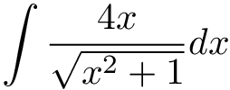
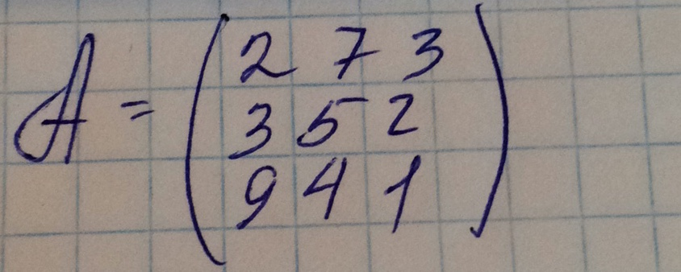

<!-- README.md is generated from README.Rmd. Please edit that file -->

```{r, echo = FALSE}
knitr::opts_chunk$set(
  collapse = TRUE,
  comment = "#>",
  fig.path = "README-"
)
```


# mathpix

[](http://www.repostatus.org/#active)
[](https://cran.r-project.org/package=mathpix)
[](commits/master)
[)`-yellowgreen.svg)](/commits/master)

[](https://travis-ci.org/jonocarroll/mathpix)
[](https://ci.appveyor.com/project/jonocarroll/mathpix)
[](https://codecov.io/gh/jonocarroll/mathpix)

[](http://www.r-pkg.org/pkg/mathpix)
[](https://github.com/jonocarroll/mathpix/network)
[](https://github.com/jonocarroll/mathpix/stargazers)
[](https://twitter.com/intent/tweet?text=Wow:&url=%5Bobject%20Object%5D)

## Installation

```{r, eval = FALSE}
devtools::install_github("jonocarroll/mathpix")
```

## Authentication

Obtain a Mathpix API key by e-mailing [support@mathpix.com](mailto:support@mathpix.com) then set the following values in your `~/.Renviron` file

```{r, eval = FALSE}
MATHPIX_APP_ID=yourID
MATHPIX_APP_KEY=yourKEY
```

I have included a general API key with this package, but misuse of it will result in it being cancelled. There is also a trial API key which can be invoked using the `trial = TRUE` argument to some functions.

## Usage

If you have an image you would rather properly encode in LaTeX, for example


then simply calling

```{r, eval = FALSE}
mathpix("./integral.jpg")
```

(with the appropriate path to the file) will insert a LaTeX block into your document which will render what the image represents

```
$$
 \int \frac { 4 x } { \sqrt { x ^ { 2 } + 1 } } d x  
$$
```

which renders to



Even complicated, hand-drawn figures work 



```{r, eval = FALSE}
mathpix("./inst/matrix_3x3.jpg")
```

```
$$
 A = \left( \begin{array} { l l l } { 2 } & { 7 } & { 3 } \\ { 3 } & { 5 } & { 2 } \\ { 9 } & { 4 } & { 1 } \\ \end{array} \right)  
$$
```


If you also wish to generate the images (although `rmarkdown` will gladly do this for you) this can be achieved using

```{r, eval = FALSE}
render_latex(latex, fileDir)
```
where `latex` is the LaTeX generated by `mathpix()` (or any other escaped LaTeX) and `fileDir` is the (optional) directory where you wish to save the image (by default, a temp file). This requires that you have `pdflatex` set up correctly and available on your machine.

## API Documentation

Refer to http://docs.mathpix.com/
