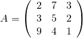

<!-- README.md is generated from README.Rmd. Please edit that file -->


# mathpix

[](http://www.repostatus.org/#active)
[](https://cran.r-project.org/package=mathpix)
[](commits/master)
[](/commits/master)

[](https://travis-ci.org/jonocarroll/mathpix)
[](https://ci.appveyor.com/project/jonocarroll/mathpix)
[](https://codecov.io/gh/jonocarroll/mathpix)

[](http://www.r-pkg.org/pkg/mathpix)
[](https://github.com/jonocarroll/mathpix/network)
[](https://github.com/jonocarroll/mathpix/stargazers)
[](https://twitter.com/intent/tweet?text=Wow:&url=%5Bobject%20Object%5D)

## Installation:

`mathpix` is now on CRAN, so you can install using

``` r
install.packages("mathpix")
```

If you’re after newer development features (if there are any); you can
install from GitHub using

``` r
devtools::install_github("jonocarroll/mathpix")
```

## Authentication

The free API key has been removed due to overuse. Please sign up at
<https://dashboard.mathpix.com/> then save your ID and key in your
`.Renviron` file as

    MATHPIX_APP_ID='yourid'
    MATHPIX_APP_KEY='yourkey'

Note that this requires you to accept Mathpix’s terms and conditions and
sign up for any relevant pricing scheme.

You can check that your credentials are loaded correctly with
`credentials()`.

## Usage

If you have an image you would rather properly encode in LaTeX, for
example


then simply calling

``` r
mathpix("./integral.jpg")
```

(with the appropriate path to the file) will insert a LaTeX block into
your document which will render what the image represents

    $$
     \int \frac { 4 x } { \sqrt { x ^ { 2 } + 1 } } d x  
    $$

which renders to


Even complicated, hand-drawn figures work


``` r
mathpix("matrix_3x3.jpg")
```

    $$
     A = \left( \begin{array} { l l l } { 2 } & { 7 } & { 3 } \\ { 3 } & { 5 } & { 2 } \\ { 9 } & { 4 } & { 1 } \\ \end{array} \right)  
    $$



If your image only result in warnings and no LaTeX, use `retry = TRUE`
to attempt some pre-processing of the image into a more amenable form.
Unfortunately, there are still images which fail.

To *not* insert the resulting equation directly into your document, but
rather store it in a variable, use `insert = FALSE`.

If you also wish to generate the images (although `rmarkdown` will
gladly do this for you) this can be achieved using

``` r
render_latex(latex, fileDir)
```

where `latex` is the LaTeX generated by `mathpix()` (or any other
escaped LaTeX) and `fileDir` is the (optional) directory where you wish
to save the image (by default, a temp file). This requires that you have
`pdflatex` set up correctly and available on your machine.

## API Documentation

Refer to <http://docs.mathpix.com/>
